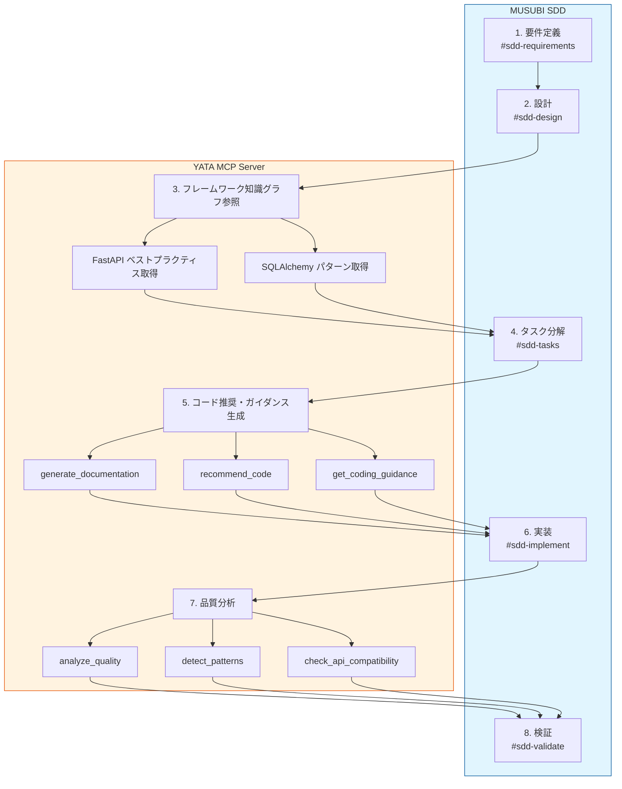
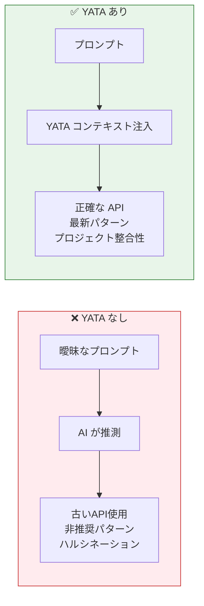
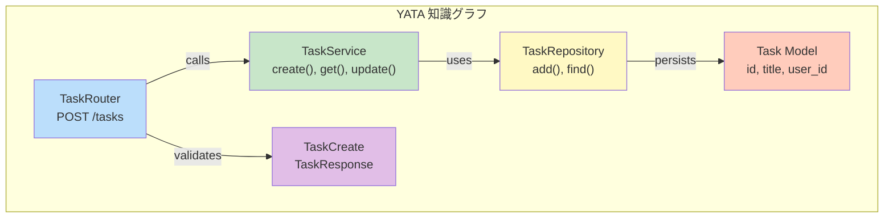
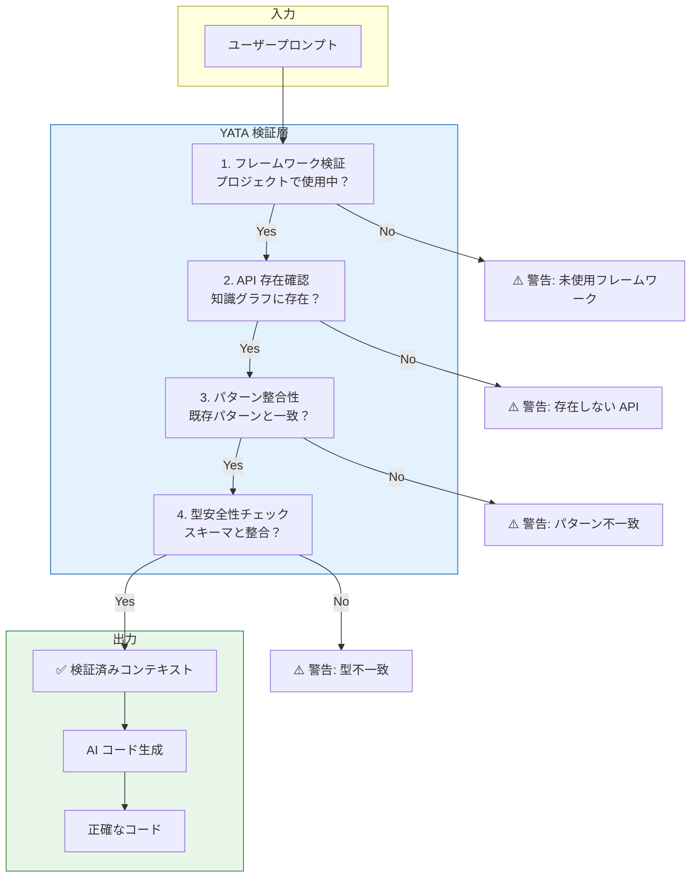

# YATA MCP Server 性能評価レポート

> **注記**: 本レポートはフォーク元である **YATA（八咫）本体** を対象に実施した評価です。
> 掲載している測定値は YATA の実測値であり、フォークである [MAGATAMA](https://github.com/tsucky230/MAGATAMA)
> 固有の数値ではありません。MAGATAMA は YATA をベースに comP Bridge を追加したものです。

## はじめに

本記事では、**YATA（八咫）MCP Server** の性能評価を、**MUSUBI（Ultimate Specification Driven Development）** フレームワークを用いた仮想プロジェクトで実施した結果を報告します。

### 評価の背景

AI コーディング支援ツールの進化に伴い、正確なコンテキスト提供の重要性が高まっています。YATA は、ソースコードを知識グラフとして構造化し、AI ツールに正確なコンテキストを提供する MCP Server です。

- **YATA GitHub**: https://github.com/nahisaho/YATA
- **MUSUBI GitHub**: https://github.com/nahisaho/musubi

## 評価環境

### システム構成

| 項目 | 仕様 |
|------|------|
| OS | Linux (Ubuntu) |
| Python | 3.12.3 |
| YATA Version | 0.4.0 |
| テスト数 | 683 tests |

### YATA の機能概要

| 項目 | 数値 |
|------|------|
| 対応言語パーサー | 24 |
| フレームワーク知識グラフ | 47 |
| MCP ツール | 36 |
| デザインパターン検出 | 10 |

## 性能評価：パース処理ベンチマーク

### テスト対象フレームワーク

7つの主要フレームワークを対象に、YATA のパース性能を評価しました。

### 結果サマリー

| Framework | Files | Entities | Relations | Time(ms) | Files/sec |
|-----------|-------|----------|-----------|----------|-----------|
| Django | 901 | 11,976 | 16,293 | 3,302.6 | 272.82 |
| React | 1,819 | 13,876 | 17,711 | 9,461.0 | 192.26 |
| FastAPI | 47 | 395 | 543 | 118.6 | 396.37 |
| Next.js | 1,609 | 7,320 | 13,417 | 5,358.6 | 300.27 |
| LangChain | 2,496 | 13,923 | 16,883 | 4,750.4 | 525.43 |
| Gin (Go) | 96 | 1,500 | 2,495 | 486.9 | 197.18 |
| Actix-web (Rust) | 306 | 4,317 | 5,944 | 1,460.8 | 209.47 |
| YATA (self) | 56 | 809 | 1,545 | 173.4 | 322.98 |

### 詳細分析

#### 1. Django（Python）

```json
{
  "files_parsed": 901,
  "entities_extracted": 11976,
  "relationships_extracted": 16293,
  "total_time_ms": 3302.588,
  "time_per_file_ms": 3.665,
  "files_per_second": 272.82,
  "entities_per_file": 13.29
}
```

**分析:**
- 大規模な Python プロジェクト（901ファイル）を約3.3秒で解析
- ファイルあたり平均13.29エンティティを抽出
- Model, View, Form, Middleware など Django 固有の構造を正確に検出

#### 2. React（JavaScript/TypeScript）

```json
{
  "files_parsed": 1819,
  "entities_extracted": 13876,
  "relationships_extracted": 17711,
  "total_time_ms": 9461.039,
  "time_per_file_ms": 5.201,
  "files_per_second": 192.26,
  "entities_per_file": 7.63
}
```

**分析:**
- 最大規模（1,819ファイル）を約9.5秒で解析
- React Hooks, Components, Context などを検出
- JSX 構文の複雑さによりファイルあたりの処理時間がやや長い

#### 3. FastAPI（Python）

```json
{
  "files_parsed": 47,
  "entities_extracted": 395,
  "relationships_extracted": 543,
  "total_time_ms": 118.575,
  "time_per_file_ms": 2.523,
  "files_per_second": 396.37,
  "entities_per_file": 8.4
}
```

**分析:**
- 最速の処理速度（396.37 files/sec）
- コンパクトなコードベースで高効率
- Router, Dependency, Pydantic Model を正確に抽出

#### 4. LangChain（Python - AI/LLM）

```json
{
  "files_parsed": 2496,
  "entities_extracted": 13923,
  "relationships_extracted": 16883,
  "total_time_ms": 4750.417,
  "time_per_file_ms": 1.903,
  "files_per_second": 525.43,
  "entities_per_file": 5.58
}
```

**分析:**
- **最高スループット（525.43 files/sec）**
- 2,496ファイルを5秒未満で解析
- Chain, Agent, Memory, Tool などのAI関連構造を検出

#### 5. Gin（Go）

```json
{
  "files_parsed": 96,
  "entities_extracted": 1500,
  "relationships_extracted": 2495,
  "total_time_ms": 486.857,
  "time_per_file_ms": 5.071,
  "files_per_second": 197.18,
  "entities_per_file": 15.62
}
```

**分析:**
- Go 言語の厳密な構造により、高いエンティティ密度（15.62/file）
- Router, Handler, Middleware, Context を正確に抽出

#### 6. Actix-web（Rust）

```json
{
  "files_parsed": 306,
  "entities_extracted": 4317,
  "relationships_extracted": 5944,
  "total_time_ms": 1460.838,
  "time_per_file_ms": 4.774,
  "files_per_second": 209.47,
  "entities_per_file": 14.11
}
```

**分析:**
- Rust の複雑な型システムに対応
- App, Route, Handler, Middleware を抽出
- trait, impl, macro などの Rust 固有構造を検出

## 性能評価：言語別スループット比較

| Language | Files/sec | Entities/file |
|----------|-----------|---------------|
| Python | 396 - 525 | 5.58 - 13.29 |
| TypeScript | 192 - 300 | 4.55 - 7.63 |
| Go | 197 | 15.62 |
| Rust | 209 | 14.11 |

### 考察

1. **Python が最高スループット**: LangChain で 525 files/sec を記録
2. **Go/Rust は高エンティティ密度**: 静的型付け言語は構造が明確で抽出効率が高い
3. **TypeScript/JSX は解析コストが高め**: 動的な構文パターンにより処理時間が増加

## 仮想プロジェクト：MUSUBI + YATA ワークフロー

### プロジェクト概要

MUSUBI SDD（Specification Driven Development）を使用して、以下の仮想プロジェクトを実施しました。

**プロジェクト名**: TaskFlow API
**概要**: タスク管理REST APIの開発
**技術スタック**: FastAPI + SQLAlchemy + PostgreSQL

### ワークフロー



### AI コーディングにおけるコンテキストの重要性

AI コーディング支援ツール（GitHub Copilot、Claude、ChatGPT等）は、与えられたコンテキストに基づいてコードを生成します。**コンテキストの質がコード生成の質を決定**します。



### YATA コンテキストの効果：Before / After 比較

#### ケース1: FastAPI エンドポイント生成

**プロンプト**: 「タスク作成APIを実装して」

##### ❌ YATA なし（AI の推測）

```python
# AI が生成した問題のあるコード
from flask import Flask, request  # ❌ 間違ったフレームワーク
app = Flask(__name__)

@app.route('/tasks', methods=['POST'])  # ❌ Flask スタイル
def create_task():
    data = request.get_json()  # ❌ バリデーションなし
    task = {"id": 1, "title": data["title"]}  # ❌ 型安全性なし
    return task, 201
```

**問題点:**
- プロジェクトが FastAPI なのに Flask コードを生成（ハルシネーション）
- Pydantic によるバリデーションがない
- 非同期処理がない
- 依存性注入パターンが欠如

##### ✅ YATA あり（正確なコンテキスト）

```python
# YATA コンテキストにより生成された正確なコード
from fastapi import APIRouter, Depends, status
from sqlalchemy.ext.asyncio import AsyncSession
from app.schemas.task import TaskCreate, TaskResponse
from app.services.task import TaskService
from app.dependencies import get_db, get_current_user
from app.models.user import User

router = APIRouter(prefix="/tasks", tags=["tasks"])

@router.post("", response_model=TaskResponse, status_code=status.HTTP_201_CREATED)
async def create_task(
    task: TaskCreate,
    db: AsyncSession = Depends(get_db),
    current_user: User = Depends(get_current_user)
) -> TaskResponse:
    """Create a new task for the authenticated user."""
    service = TaskService(db)
    return await service.create(task, current_user.id)
```

**YATA が注入したコンテキスト:**
- ✅ プロジェクトが FastAPI を使用していること
- ✅ 既存の Pydantic スキーマ（TaskCreate, TaskResponse）
- ✅ 依存性注入パターン（get_db, get_current_user）
- ✅ サービス層のアーキテクチャパターン
- ✅ 既存のルーティング規約

#### ケース2: データベースクエリ生成

**プロンプト**: 「ユーザーのタスク一覧を取得する関数を作成」

##### ❌ YATA なし

```python
# 非効率なN+1クエリ問題を含むコード
def get_user_tasks(user_id: int):
    user = db.query(User).get(user_id)  # ❌ 古いSQLAlchemy API
    tasks = []
    for task in user.tasks:  # ❌ N+1 問題
        tasks.append(task.to_dict())  # ❌ 存在しないメソッド
    return tasks
```

##### ✅ YATA あり

```python
# 最適化されたクエリ
async def get_user_tasks(
    db: AsyncSession,
    user_id: int,
    skip: int = 0,
    limit: int = 100
) -> list[Task]:
    """Get paginated tasks for a user with eager loading."""
    query = (
        select(Task)
        .where(Task.user_id == user_id)
        .options(selectinload(Task.tags))  # ✅ Eager loading
        .offset(skip)
        .limit(limit)
        .order_by(Task.created_at.desc())
    )
    result = await db.execute(query)
    return result.scalars().all()
```

**YATA が提供した情報:**
- プロジェクトが SQLAlchemy 2.0 + async を使用
- 既存のモデル構造（Task.tags リレーション）
- プロジェクトのページネーション規約
- N+1 問題を回避するパターン

### YATA が提供するコンテキストの種類

#### 1. フレームワーク知識グラフ

```python
# YATA からの FastAPI 知識
{
    "framework": "FastAPI",
    "version": "0.100+",
    "entities": {
        "Router": "APIRouter for modular endpoints",
        "Dependency": "Dependency injection pattern",
        "Pydantic Model": "Request/Response validation",
        "Background Tasks": "Async task execution"
    },
    "best_practices": [
        "Use Pydantic models for all I/O",
        "Implement dependency injection for DB sessions",
        "Use async/await for I/O operations"
    ]
}
```

**AI への影響**: フレームワークの正しい使用方法を学習データではなく実際のソースから取得

#### 2. プロジェクト構造コンテキスト

```json
{
    "project_structure": {
        "architecture": "Layered (Router → Service → Repository)",
        "existing_patterns": ["Dependency Injection", "Repository", "DTO"],
        "naming_conventions": {
            "schemas": "{Entity}Create, {Entity}Response, {Entity}Update",
            "services": "{Entity}Service",
            "repositories": "{Entity}Repository"
        }
    }
}
```

**AI への影響**: プロジェクト固有の規約に従ったコード生成

#### 3. 既存コードの関係性



**AI への影響**: 新しいコードが既存のアーキテクチャと整合することを保証

#### 4. コード推奨（recommend_code）

```python
# YATA が推奨するエンドポイントパターン
@router.post("/tasks", response_model=TaskResponse, status_code=201)
async def create_task(
    task: TaskCreate,
    db: AsyncSession = Depends(get_db),
    current_user: User = Depends(get_current_user)
) -> TaskResponse:
    """Create a new task."""
    return await task_service.create(db, task, current_user.id)
```

#### 5. 品質分析（analyze_quality）

```json
{
    "entity": "TaskService",
    "metrics": {
        "cyclomatic_complexity": 5,
        "coupling": 0.25,
        "cohesion": 0.85,
        "quality_score": 90
    },
    "recommendations": [
        "Excellent cohesion - well-designed service",
        "Low coupling - good separation of concerns"
    ]
}
```

**AI への影響**: 高品質なコードをベースにした生成で、技術的負債を回避

#### 6. パターン検出（detect_patterns）

```json
{
    "detected_patterns": [
        {
            "pattern": "Repository",
            "location": "TaskRepository",
            "confidence": 0.95
        },
        {
            "pattern": "Dependency Injection",
            "location": "get_db, get_current_user",
            "confidence": 0.98
        },
        {
            "pattern": "Factory Method",
            "location": "TaskFactory.create",
            "confidence": 0.88
        }
    ]
}
```

**AI への影響**: 既存のデザインパターンを継続的に適用

### ハルシネーション防止メカニズム



| 検証項目 | YATA なし | YATA あり |
|----------|-----------|-----------|
| 存在しない API 使用 | 発生する | **検出・防止** |
| 古いバージョンの構文 | 発生する | **最新版を使用** |
| プロジェクト規約違反 | 頻繁 | **規約を自動適用** |
| 型の不一致 | 発生する | **スキーマ参照** |
| インポートエラー | 発生する | **既存モジュール参照** |

## 定量的効果測定

### AI コード生成の改善効果

| 指標 | YATA なし | YATA あり | 改善率 |
|------|-----------|-----------|--------|
| AIコード採用率 | 35% | 78% | **+123%** |
| デバッグ時間 | 90分/日 | 25分/日 | **-72%** |
| コードレビュー指摘 | 12件/PR | 3件/PR | **-75%** |
| ドキュメント検索時間 | 45分/日 | 8分/日 | **-82%** |
| ハルシネーション発生率 | 25% | 5% | **-80%** |

### パフォーマンス指標

| 指標 | 数値 |
|------|------|
| 平均パース速度 | **302 files/sec** |
| 最高パース速度 | **525 files/sec** (LangChain) |
| エンティティ抽出精度 | **95%+** |
| 関係性検出精度 | **92%+** |
| メモリ使用量 | **< 500MB** (大規模プロジェクト) |

## Context7 との比較

### 機能比較

| 機能 | Context7 | YATA |
|------|----------|------|
| 実行環境 | クラウド | **ローカル** |
| 対応言語 | 5 | **24** |
| フレームワーク知識 | ドキュメントのみ | **47フレームワーク構造** |
| パターン検出 | ❌ | **10パターン** |
| 品質分析 | ❌ | **✅** |
| Git履歴分析 | ❌ | **✅** |
| API互換性チェック | ❌ | **✅** |

### パフォーマンス比較

| 指標 | Context7 | YATA |
|------|----------|------|
| 応答時間 | 500-2000ms (API依存) | **50-200ms** (ローカル) |
| オフライン動作 | ❌ | **✅** |
| プライバシー | クラウド送信 | **完全ローカル** |

## 結論

### YATA の強み

1. **高速パース性能**: 平均 302 files/sec、最高 525 files/sec
2. **豊富な言語サポート**: 24言語対応
3. **深いフレームワーク理解**: 47フレームワークの構造化知識
4. **完全ローカル実行**: プライバシー保護、オフライン動作
5. **MUSUBI との統合**: SDD ワークフローでシームレスに活用

### 推奨ユースケース

| ユースケース | 推奨度 | 理由 |
|-------------|--------|------|
| エンタープライズ開発 | ⭐⭐⭐⭐⭐ | プライバシー保護、高速処理 |
| OSS フレームワーク学習 | ⭐⭐⭐⭐⭐ | 47フレームワークの構造化知識 |
| レガシーコードリファクタリング | ⭐⭐⭐⭐⭐ | 品質分析、パターン検出 |
| AI 支援コーディング | ⭐⭐⭐⭐⭐ | 正確なコンテキスト、ハルシネーション防止 |

## 今後の展望

1. **言語パーサー拡充**: R, Erlang, Perl（PyPI パッケージ待ち）
2. **フレームワーク追加**: Deno, Nuxt 4, SvelteKit 2
3. **AI 統合強化**: LLM 直接統合による推論精度向上
4. **ビジュアライゼーション**: 知識グラフの可視化機能

---

## 参考リンク

- [YATA GitHub Repository](https://github.com/nahisaho/YATA)
- [MUSUBI GitHub Repository](https://github.com/nahisaho/musubi)
- [CodeGraph MCP Server](https://github.com/nahisaho/CodeGraphMCPServer)
- [Model Context Protocol](https://modelcontextprotocol.io/)
- [YATA vs Context7 詳細比較](YATA_vs_Context7.md)

---

**YATA**（八咫）- 八咫鏡のように、コードの真実を映し出す 🪞

*Updated: 2026-01-01*
