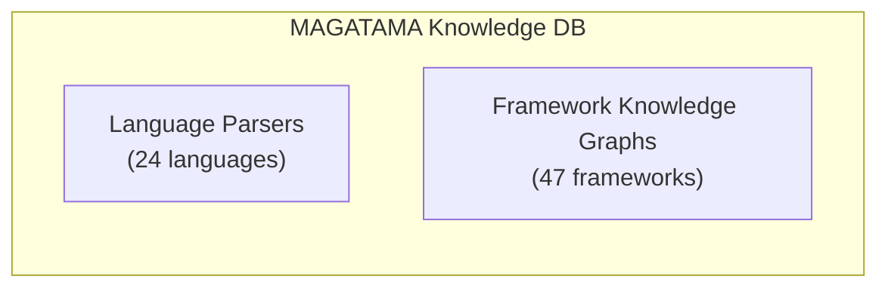

# MAGATAMA Knowledge Database Update Guide

This guide explains how to update MAGATAMA's knowledge database when new versions of programming languages or frameworks are released.
(MAGATAMA is a fork of [YATA](https://github.com/nahisaho/YATA); the framework-knowledge feature is inherited from YATA. The CLI command is `magatama`.)

## Table of Contents

1. [Overview](#overview)
2. [Quick Start (Automatic Update)](#quick-start-automatic-update)
3. [Prerequisites](#prerequisites)
4. [Step 1: Obtain Source Code from GitHub](#step-1-obtain-source-code-from-github)
5. [Step 2: Source Code Analysis](#step-2-source-code-analysis)
6. [Step 3: Building Knowledge Graph](#step-3-building-knowledge-graph)
7. [Step 4: Registering Framework Knowledge Graph](#step-4-registering-framework-knowledge-graph)
8. [Step 5: Verification and Testing](#step-5-verification-and-testing)
9. [Automatic Update Configuration](#automatic-update-configuration)
10. [Troubleshooting](#troubleshooting)

---

## Overview

MAGATAMA's knowledge database consists of two types:

| Type | Description | Update Frequency |
|------|-------------|------------------|
| **Language Parsers** | AST analysis definitions via Tree-sitter | When language specs change |
| **Framework Knowledge Graphs** | Framework structure, APIs, patterns | When new versions release |



---

## Quick Start (Automatic Update)

Using the `update_knowledge_db.py` script, you can automatically update all 47 framework repositories and rebuild knowledge graphs.

### Update All Frameworks

```bash
# Activate virtual environment
cd /path/to/MAGATAMA
source .venv/bin/activate

# Bulk update all frameworks (git pull + rebuild knowledge graphs)
python scripts/update_knowledge_db.py
```

### Common Options

```bash
# Update specific frameworks only
python scripts/update_knowledge_db.py --frameworks react vue django

# Clone missing frameworks
python scripts/update_knowledge_db.py --clone-missing

# Skip git pull and only rebuild knowledge graphs
python scripts/update_knowledge_db.py --no-update

# Update repositories only (skip knowledge graph building)
python scripts/update_knowledge_db.py --no-analyze

# Dry run (don't actually execute)
python scripts/update_knowledge_db.py --dry-run

# Specify parallel execution count (default: 4)
python scripts/update_knowledge_db.py --parallel 8
```

### Output Example

```
================================================================================
🔄 MAGATAMA Knowledge Database Updater
================================================================================
Frameworks: 47
Base path: /path/to/MAGATAMA/frameworks

📥 Updating repositories...
  ✅ React: Already up to date
  ✅ Django: Already up to date
  ✅ FastAPI: Updated: Fast-forward
  ...

🧠 Rebuilding knowledge graphs...
  [ 1/47] React... ✅ 2,847 entities, 1,523 relationships
  [ 2/47] Django... ✅ 5,234 entities, 3,891 relationships
  ...

================================================================================
📊 Summary
================================================================================
Git operations: 45 updated, 0 cloned, 2 failed
Frameworks analyzed: 47
Total entities: 89,234
Total relationships: 45,678

📄 Summary saved to: /path/to/MAGATAMA/knowledge_graphs/update_summary.json
```

---

## Prerequisites

### Required Tools

```bash
# MAGATAMA environment
cd /path/to/magatama
source .venv/bin/activate

# Check required packages
pip list | grep -E "magatama|tree-sitter|networkx"
```

### Required Permissions

- GitHub access (not required for public repos)
- Directory with write permissions

---

## Step 1: Obtain Source Code from GitHub

### 1.1 Clone Repository

```bash
# Create working directory
mkdir -p ~/magatama-knowledge-update
cd ~/magatama-knowledge-update

# Get framework source code
# Example: Django 5.0
git clone --depth 1 --branch v5.0 https://github.com/django/django.git django-5.0

# Example: FastAPI 0.110
git clone --depth 1 --branch 0.110.0 https://github.com/tiangolo/fastapi.git fastapi-0.110

# Example: React 19
git clone --depth 1 --branch v19.0.0 https://github.com/facebook/react.git react-19
```

### 1.2 Get Specific Tag/Branch

```bash
# Check available tags
git ls-remote --tags https://github.com/django/django.git | tail -20

# Checkout specific version
git clone https://github.com/django/django.git django-latest
cd django-latest
git checkout tags/v5.0 -b v5.0-branch
```

### 1.3 Automatic Retrieval Using GitHub API

```python
#!/usr/bin/env python3
"""
framework_downloader.py - Framework source code auto-retrieval tool
"""
import subprocess
import requests
from pathlib import Path

FRAMEWORKS = {
    "django": {
        "repo": "django/django",
        "language": "python",
        "extensions": ["*.py"],
    },
    "fastapi": {
        "repo": "tiangolo/fastapi",
        "language": "python",
        "extensions": ["*.py"],
    },
    "react": {
        "repo": "facebook/react",
        "language": "javascript",
        "extensions": ["*.js", "*.jsx", "*.ts", "*.tsx"],
    },
    "vue": {
        "repo": "vuejs/core",
        "language": "typescript",
        "extensions": ["*.ts", "*.vue"],
    },
    "nextjs": {
        "repo": "vercel/next.js",
        "language": "typescript",
        "extensions": ["*.ts", "*.tsx"],
    },
}

def get_latest_release(repo: str) -> str:
    """Get latest release tag from GitHub"""
    url = f"https://api.github.com/repos/{repo}/releases/latest"
    response = requests.get(url)
    if response.status_code == 200:
        return response.json()["tag_name"]
    return "main"

def clone_framework(name: str, version: str = None, output_dir: str = "."):
    """Clone framework"""
    config = FRAMEWORKS.get(name)
    if not config:
        print(f"Unknown framework: {name}")
        return None
    
    repo = config["repo"]
    
    # Get latest if version not specified
    if not version:
        version = get_latest_release(repo)
    
    output_path = Path(output_dir) / f"{name}-{version}"
    
    if output_path.exists():
        print(f"Already exists: {output_path}")
        return output_path
    
    # Execute clone
    cmd = [
        "git", "clone",
        "--depth", "1",
        "--branch", version,
        f"https://github.com/{repo}.git",
        str(output_path)
    ]
    
    print(f"Cloning {name} {version}...")
    subprocess.run(cmd, check=True)
    
    return output_path

if __name__ == "__main__":
    import sys
    
    if len(sys.argv) < 2:
        print("Usage: python framework_downloader.py <framework> [version]")
        print(f"Available: {', '.join(FRAMEWORKS.keys())}")
        sys.exit(1)
    
    framework = sys.argv[1]
    version = sys.argv[2] if len(sys.argv) > 2 else None
    
    path = clone_framework(framework, version, "./frameworks")
    if path:
        print(f"Downloaded to: {path}")
```

Usage:

```bash
# Get latest version
python framework_downloader.py django

# Get specific version
python framework_downloader.py django v5.0

# Bulk get multiple frameworks
for fw in django fastapi react vue; do
    python framework_downloader.py $fw
done
```

---

## Step 2: Source Code Analysis

### 2.1 Parse Directory with MAGATAMA Parser

```bash
# Use MAGATAMA CLI
magatama parse ./frameworks/django-5.0 \
    --pattern "**/*.py" \
    --exclude "**/tests/**" \
    --exclude "**/migrations/**" \
    --output django-5.0-graph.json

# For TypeScript/JavaScript projects
magatama parse ./frameworks/react-19 \
    --pattern "**/*.js" \
    --pattern "**/*.jsx" \
    --pattern "**/*.ts" \
    --pattern "**/*.tsx" \
    --exclude "**/node_modules/**" \
    --exclude "**/__tests__/**" \
    --output react-19-graph.json
```

### 2.2 Analysis via Python Script

```python
#!/usr/bin/env python3
"""
parse_framework.py - Framework analysis script
"""
from pathlib import Path
from magatama_core.application.usecases import ParseDirectoryUseCase, ParseFileUseCase
from magatama_core.infrastructure.parsers import PythonParser, TypeScriptParser
from magatama_core.infrastructure.graph import NetworkXKnowledgeGraph

def parse_framework(
    source_dir: str,
    framework_name: str,
    version: str,
    language: str = "python",
    exclude_patterns: list = None
):
    """Parse framework and build knowledge graph"""
    
    # Select parser
    parsers = {
        "python": PythonParser(),
        "typescript": TypeScriptParser(),
        "javascript": TypeScriptParser(),  # JS also handled by TS parser
    }
    parser = parsers.get(language)
    if not parser:
        raise ValueError(f"Unsupported language: {language}")
    
    # Initialize knowledge graph
    graph = NetworkXKnowledgeGraph()
    
    # Use cases
    parse_file_uc = ParseFileUseCase(parser, graph)
    parse_dir_uc = ParseDirectoryUseCase(parse_file_uc, graph)
    
    # Exclude patterns
    exclude = exclude_patterns or [
        "**/tests/**",
        "**/test/**",
        "**/__pycache__/**",
        "**/node_modules/**",
        "**/dist/**",
        "**/build/**",
    ]
    
    # Extension patterns
    patterns = {
        "python": ["**/*.py"],
        "typescript": ["**/*.ts", "**/*.tsx"],
        "javascript": ["**/*.js", "**/*.jsx"],
    }
    
    # Execute analysis
    print(f"Parsing {framework_name} {version}...")
    result = parse_dir_uc.execute(
        directory=source_dir,
        patterns=patterns.get(language, ["**/*"]),
        exclude_patterns=exclude
    )
    
    print(f"  Files parsed: {result.files_parsed}")
    print(f"  Entities found: {result.entities_count}")
    print(f"  Relationships: {result.relationships_count}")
    
    # Save graph
    output_file = f"{framework_name}-{version}-knowledge-graph.json"
    graph.save(output_file)
    print(f"  Saved to: {output_file}")
    
    return graph, result

if __name__ == "__main__":
    import sys
    
    if len(sys.argv) < 4:
        print("Usage: python parse_framework.py <source_dir> <framework_name> <version> [language]")
        sys.exit(1)
    
    source_dir = sys.argv[1]
    framework_name = sys.argv[2]
    version = sys.argv[3]
    language = sys.argv[4] if len(sys.argv) > 4 else "python"
    
    parse_framework(source_dir, framework_name, version, language)
```

Usage:

```bash
# Parse Django
python parse_framework.py ./frameworks/django-5.0 django 5.0 python

# Parse React
python parse_framework.py ./frameworks/react-19 react 19.0 javascript
```

### 2.3 Verify Analysis Results

```bash
# Display statistics
magatama stats --graph django-5.0-knowledge-graph.json

# Search entities
magatama query "Model" --type class --graph django-5.0-knowledge-graph.json

# Validate integrity
magatama validate --graph django-5.0-knowledge-graph.json
```

---

## Step 3: Building Knowledge Graph

### 3.1 Adding Extended Information to Entities

Add documentation and metadata to analysis results.

```python
#!/usr/bin/env python3
"""
enrich_knowledge_graph.py - Knowledge graph enrichment
"""
import json
from pathlib import Path

def enrich_entity(entity: dict, framework_docs: dict) -> dict:
    """Add documentation info to entity"""
    
    name = entity.get("name", "")
    
    # Add info from official documentation
    if name in framework_docs:
        doc_info = framework_docs[name]
        entity["documentation"] = doc_info.get("description", "")
        entity["examples"] = doc_info.get("examples", [])
        entity["since_version"] = doc_info.get("since", "")
        entity["deprecated"] = doc_info.get("deprecated", False)
        entity["deprecated_in"] = doc_info.get("deprecated_in", "")
        entity["replacement"] = doc_info.get("replacement", "")
    
    return entity

def enrich_graph(graph_file: str, docs_file: str, output_file: str):
    """Enrich entire knowledge graph"""
    
    with open(graph_file, "r") as f:
        graph = json.load(f)
    
    with open(docs_file, "r") as f:
        docs = json.load(f)
    
    # Enrich each entity
    for entity_id, entity in graph.get("entities", {}).items():
        graph["entities"][entity_id] = enrich_entity(entity, docs)
    
    # Save
    with open(output_file, "w") as f:
        json.dump(graph, f, indent=2, ensure_ascii=False)
    
    print(f"Enriched graph saved to: {output_file}")

# Example Django documentation info
DJANGO_DOCS = {
    "Model": {
        "description": "Base class for Django ORM. Represents database tables",
        "examples": [
            "class Article(models.Model):\n    title = models.CharField(max_length=200)",
        ],
        "since": "1.0",
    },
    "View": {
        "description": "Class-based view for handling HTTP requests",
        "examples": [
            "class ArticleView(View):\n    def get(self, request):\n        return HttpResponse('Hello')",
        ],
        "since": "1.3",
    },
    # ... other entities
}
```

---

## Step 4: Registering Framework Knowledge Graph

### 4.1 Registration to MAGATAMA

```python
#!/usr/bin/env python3
"""
register_framework.py - Framework knowledge graph registration
"""
from magatama_core.application.usecases import RegisterFrameworkUseCase
from magatama_core.infrastructure.graph import NetworkXKnowledgeGraph

def register_framework(
    graph_file: str,
    framework_name: str,
    version: str,
    category: str,
    description: str
):
    """Register framework knowledge graph to MAGATAMA"""
    
    # Load graph
    graph = NetworkXKnowledgeGraph()
    graph.load(graph_file)
    
    # Registration metadata
    metadata = {
        "name": framework_name,
        "version": version,
        "category": category,  # web-framework, testing, data-science, etc.
        "description": description,
        "language": detect_primary_language(graph),
        "entity_count": graph.get_stats()["total_entities"],
        "relationship_count": graph.get_stats()["total_relationships"],
    }
    
    # Register
    register_uc = RegisterFrameworkUseCase(graph)
    result = register_uc.execute(
        framework_id=f"{framework_name}-{version}",
        metadata=metadata
    )
    
    print(f"Registered: {framework_name} {version}")
    print(f"  Entities: {metadata['entity_count']}")
    print(f"  Relationships: {metadata['relationship_count']}")
    
    return result

if __name__ == "__main__":
    # Example: Register Django 5.0
    register_framework(
        graph_file="django-5.0-knowledge-graph.json",
        framework_name="django",
        version="5.0",
        category="web-framework",
        description="The web framework for perfectionists with deadlines"
    )
```

### 4.2 Registration via MCP Tool

```bash
# With MAGATAMA server running
magatama register-framework \
    --graph django-5.0-knowledge-graph.json \
    --name django \
    --version 5.0 \
    --category web-framework
```

---

## Step 5: Verification and Testing

### 5.1 Knowledge Graph Verification

```bash
# Integrity check
magatama validate --graph django-5.0-knowledge-graph.json --repair

# Check statistics
magatama stats --graph django-5.0-knowledge-graph.json --json
```

### 5.2 Functional Testing

```python
#!/usr/bin/env python3
"""
test_framework_knowledge.py - Framework knowledge tests
"""
import pytest
from magatama_core.application.usecases import (
    SearchFrameworkUseCase,
    GetFrameworkEntityUseCase,
    GetCodingGuidanceUseCase,
)

class TestDjango50Knowledge:
    """Django 5.0 knowledge graph tests"""
    
    @pytest.fixture
    def framework_graph(self):
        from magatama_core.infrastructure.frameworks.django_5_0 import get_django_5_0_graph
        return get_django_5_0_graph()
    
    def test_model_class_exists(self, framework_graph):
        """Model class exists"""
        entity = framework_graph.get_entity_by_name("Model")
        assert entity is not None
        assert entity.type == "class"
    
    def test_model_has_methods(self, framework_graph):
        """Model class has major methods"""
        entity = framework_graph.get_entity_by_name("Model")
        assert "save" in entity.methods
        assert "delete" in entity.methods
    
    def test_search_middleware(self, framework_graph):
        """Can search for middleware"""
        search_uc = SearchFrameworkUseCase(framework_graph)
        results = search_uc.execute("middleware")
        assert len(results) > 0
    
    def test_coding_guidance_available(self, framework_graph):
        """Coding guidance can be retrieved"""
        guidance_uc = GetCodingGuidanceUseCase(framework_graph)
        result = guidance_uc.execute(
            framework="django",
            task="create model"
        )
        assert result.recommended_code is not None
        assert "models.Model" in result.recommended_code

# Run tests
# pytest test_framework_knowledge.py -v
```

### 5.3 Integration Tests

```bash
# Run all tests
cd /path/to/magatama
python -m pytest packages/magatama-core/tests/ -v

# Framework-related only
python -m pytest packages/magatama-core/tests/ -k "framework" -v
```

---

## Automatic Update Configuration

### Automatic Update with GitHub Actions

```yaml
# .github/workflows/update-frameworks.yml
name: Update Framework Knowledge

on:
  schedule:
    # Run every Monday at 3:00 AM (UTC)
    - cron: '0 3 * * 1'
  workflow_dispatch:
    inputs:
      framework:
        description: 'Framework to update'
        required: false
        default: 'all'

jobs:
  check-updates:
    runs-on: ubuntu-latest
    outputs:
      updates: ${{ steps.check.outputs.updates }}
    steps:
      - uses: actions/checkout@v4
      
      - name: Check for framework updates
        id: check
        run: |
          python scripts/check_framework_updates.py > updates.json
          echo "updates=$(cat updates.json)" >> $GITHUB_OUTPUT

  update-framework:
    needs: check-updates
    if: needs.check-updates.outputs.updates != '[]'
    runs-on: ubuntu-latest
    strategy:
      matrix:
        framework: ${{ fromJson(needs.check-updates.outputs.updates) }}
    
    steps:
      - uses: actions/checkout@v4
      
      - name: Set up Python
        uses: actions/setup-python@v5
        with:
          python-version: '3.12'
      
      - name: Install dependencies
        run: |
          pip install uv
          uv sync --all-packages
      
      - name: Download framework source
        run: |
          python scripts/framework_downloader.py ${{ matrix.framework.name }} ${{ matrix.framework.version }}
      
      - name: Parse and build knowledge graph
        run: |
          python scripts/parse_framework.py \
            ./frameworks/${{ matrix.framework.name }}-${{ matrix.framework.version }} \
            ${{ matrix.framework.name }} \
            ${{ matrix.framework.version }} \
            ${{ matrix.framework.language }}
      
      - name: Run tests
        run: |
          python -m pytest packages/magatama-core/tests/ -k "framework" -v
      
      - name: Create Pull Request
        uses: peter-evans/create-pull-request@v6
        with:
          title: "Update ${{ matrix.framework.name }} to ${{ matrix.framework.version }}"
          body: |
            Automated update of ${{ matrix.framework.name }} knowledge graph.
            
            - Version: ${{ matrix.framework.version }}
            - Entities: (see stats)
            - Tests: Passed
          branch: "update-${{ matrix.framework.name }}-${{ matrix.framework.version }}"
```

---

## Troubleshooting

### Common Issues and Solutions

#### 1. Parse Failure

```bash
# Error: UnicodeDecodeError
# Solution: Specify encoding
magatama parse ./framework --encoding utf-8

# Error: File too large
# Solution: Increase max file size
export MAGATAMA_MAX_FILE_SIZE=52428800  # 50MB
```

#### 2. Knowledge Graph Inconsistency

```bash
# Validate and repair
magatama validate --graph framework.json --repair

# Check manually
magatama query "*" --type class --graph framework.json | head -20
```

#### 3. Registration Failure

```python
# Run in debug mode
import logging
logging.basicConfig(level=logging.DEBUG)

from magatama_core.application.usecases import RegisterFrameworkUseCase
# ...
```

### Check Logs

```bash
# Enable verbose logging
export MAGATAMA_LOG_LEVEL=DEBUG
magatama parse ./framework --output graph.json 2>&1 | tee parse.log
```

---

## Reference Links

- [MAGATAMA GitHub Repository](https://github.com/tsucky230/MAGATAMA)
- [YATA GitHub Repository](https://github.com/nahisaho/YATA) (upstream / fork source)
- [Tree-sitter Documentation](https://tree-sitter.github.io/tree-sitter/)
- [GitHub API Documentation](https://docs.github.com/en/rest)

---

**Last Updated**: 2026-01-01
